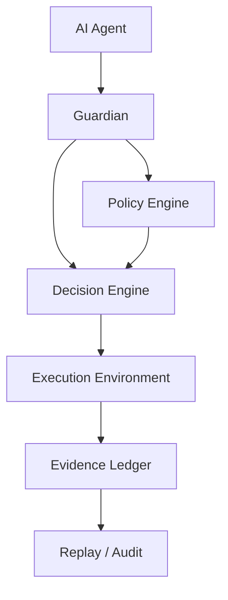

# Guardian

Governance infrastructure for autonomous AI agents.

AI agents can already execute code, access systems, call APIs, and trigger real-world actions.

But most agent systems cannot answer one simple question:

**Who approved the action?**

Guardian introduces a deterministic governance layer between AI agents and execution environments.

Instead of:

Agent → Tool → Execution

Guardian inserts a control plane:

```
LLM
  ↓
Agent
  ↓
Guardian
  ↓
Execution
  ↓
Evidence
```

Every action becomes:

Intent → Policy → Decision → Evidence → Execution

Guardian ensures autonomous systems remain:

* controllable
* auditable
* replayable
* safe to operate in production

## Architecture



## The Problem

Modern AI agents can:

- write code
- execute commands
- access databases
- call cloud APIs
- trigger financial or operational workflows

But most systems still look like this:

```
Agent → Tool → Execution
```

This creates serious gaps:

- no permission layer
- no policy enforcement
- no decision audit
- no accountability

Examples:

- agent deletes production database
- agent deploys unsafe code
- agent leaks secrets
- agent triggers unintended actions

## The Missing Layer

Production systems need more than agent capability.

They need:

- permission
- policy
- deterministic decision making
- evidence
- replay verification

Guardian adds that missing layer:

```
LLM
  ↓
Agent
  ↓
Guardian
  ↓
Execution
  ↓
Evidence
```

## What Guardian Does

Guardian enforces five core ideas:

1. **Intent**  
   Agents must declare what they want to do.

2. **Policy as Code**  
   Behavior is controlled by declared rules, not hidden logic.

3. **Deterministic Decisions**  
   Guardian returns ALLOW, DENY, or ESCALATE.

4. **Evidence Ledger**  
   Every decision is recorded as verifiable evidence.

5. **Replay Verification**  
   Decisions can be replayed and validated against policy.

## Policy as Code

Guardian policies are declared as rules instead of hardcoded branching logic.

Example:

```json
[
  {
    "actor": "*",
    "action": "send_email",
    "target": "*",
    "effect": "ALLOW"
  },
  {
    "actor": "*",
    "action": "delete_database",
    "target": "*",
    "effect": "DENY"
  },
  {
    "actor": "agent_finance",
    "action": "transfer_funds",
    "target": "*",
    "effect": "ESCALATE"
  }
]
```

## Architecture

### System Flow

```
LLM
│
▼
Agent
│
▼
Guardian
│
├── Policy Engine
├── Decision Engine
├── Permission Model
│
▼
Decision (ALLOW / DENY / ESCALATE)
│
▼
Evidence Ledger
│
▼
Execution
```

Guardian acts as the governance control plane between autonomous agents and execution environments.

```
Intent
  ↓
Policy
  ↓
Decision
  ↓
Evidence
  ↓
Execution
```

Internal components:

- Decision Engine
- Policy Engine
- Permission Model
- Evidence Ledger
- Replay Verifier

## Quickstart

```bash
python examples/demo.py
python examples/replay_demo.py
python examples/agent_integration_demo.py
```

Expected behaviors:

- `send_email` → ALLOW
- `delete_database` → DENY
- `transfer_funds` → ESCALATE

## Example Use Cases

**AI Coding Agents**  
Prevent unsafe code modifications or destructive actions.

**Infrastructure Automation**  
Control cloud or database operations before execution.

**Financial Agents**  
Require escalation for sensitive actions like fund transfers.

**Enterprise AI Workflows**  
Provide evidence and replayability for AI actions.

## Why This Matters

AI capability is increasing rapidly.

But capability without governance is dangerous.

Guardian exists to make autonomous systems:

- controllable
- auditable
- replayable
- safer to trust in production

## Roadmap

- **Stage 1** — Core governance engine
- **Stage 2** — Evidence ledger and replay verification
- **Stage 3** — Policy DSL and permission model
- **Stage 4** — Developer integrations
- **Stage 5** — Hosted governance workflows

## Status

Experimental infrastructure project.
Focused on deterministic governance for autonomous systems.

## License

Apache-2.0. See [LICENSE](LICENSE) for details.
