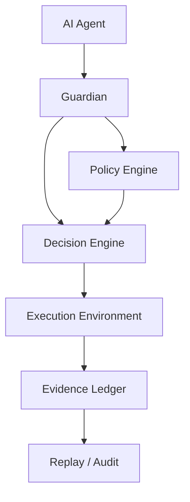

# Guardian

Governance infrastructure for autonomous AI agents

AI agents can now:

- write code
- run shell commands
- access databases
- call cloud APIs
- trigger financial or operational workflows

But most agent systems still look like this:

```
Agent → Tool → Execution
```

This architecture is powerful — but dangerously incomplete.

When something goes wrong, most systems cannot answer:

- Who approved the action?
- What policy allowed it?
- Can the decision be replayed?
- Is there verifiable evidence?

Guardian introduces a deterministic governance layer between AI agents and execution environments.

## The Missing Layer

Modern autonomous systems need more than capability.

They need governance.

Guardian inserts a control plane between agents and execution:

```
LLM
  ↓
Agent
  ↓
Guardian
  ↓
Execution
  ↓
Evidence
```

Every action becomes:

```
Intent → Policy → Decision → Evidence → Execution
```

This makes agent behavior:

- controllable
- auditable
- replayable
- safe to operate in production

## Architecture



Guardian acts as a governance control plane.

Before any action executes:

1. The agent declares intent
2. Guardian evaluates policy
3. A deterministic decision is produced
4. Evidence is written to a ledger
5. Only then does execution happen

## Core Principles

Guardian is built around five ideas.

**Intent** — Agents must explicitly declare the action they intend to perform.

**Policy as Code** — Behavior is controlled by declarative policies rather than hidden logic.

**Deterministic Decisions** — Guardian returns one of three outcomes: `ALLOW`, `DENY`, `ESCALATE`.

**Evidence Ledger** — Every decision is recorded as verifiable evidence.

**Replay Verification** — Decisions can be replayed and validated against policy.

## Policy Example

Guardian policies are simple rule declarations.

```json
[
  {
    "actor": "*",
    "action": "send_email",
    "target": "*",
    "effect": "ALLOW"
  },
  {
    "actor": "*",
    "action": "delete_database",
    "target": "*",
    "effect": "DENY"
  },
  {
    "actor": "agent_finance",
    "action": "transfer_funds",
    "target": "*",
    "effect": "ESCALATE"
  }
]
```

## Why This Matters

AI capabilities are increasing rapidly.

Agents can now:

- modify infrastructure
- deploy code
- move data
- trigger financial transactions

Without governance, the risk surface grows dramatically.

Examples of real failure modes:

- agent deletes production database
- agent deploys unsafe code
- agent leaks secrets
- agent triggers unintended workflows

Guardian exists to make autonomous systems safer to trust in production.

## Quickstart

Run the examples:

```bash
python examples/demo.py
python examples/replay_demo.py
python examples/agent_integration_demo.py
```

Expected behavior:

- `send_email` → ALLOW
- `delete_database` → DENY
- `transfer_funds` → ESCALATE

## Example Use Cases

**AI Coding Agents** — Prevent destructive repository changes or unsafe deployments.

**Infrastructure Automation** — Control cloud and database operations before execution.

**Financial Agents** — Require escalation for sensitive actions like fund transfers.

**Enterprise AI Workflows** — Provide evidence and replayability for AI actions.

## Status

Experimental infrastructure project.

Focused on deterministic governance for autonomous systems.

## Roadmap

- Stage 1 — Core governance engine
- Stage 2 — Evidence ledger and replay verification
- Stage 3 — Policy DSL and permission model
- Stage 4 — Developer integrations
- Stage 5 — Hosted governance workflows

## License

Apache-2.0. See [LICENSE](LICENSE) for details.
